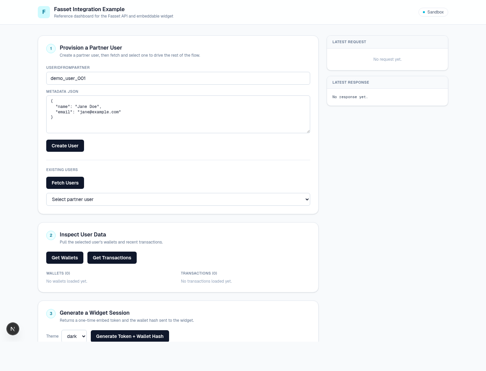

# Fasset Integration Example

A Next.js sandbox dashboard that walks through the full Fasset API + embeddable
widget integration end-to-end. Use it to validate your sandbox setup before
building your own backend, or as a reference implementation to port from.



## What it does

- Provisions a partner user (`POST /partners/create-user`)
- Lists / selects partner users
- Fetches the selected user's wallets and recent transactions
- Generates a one-time embed token + wallet hash and embeds the widget via
  iframe + `postMessage`
- Receives webhooks at `/api/fasset/webhooks` (use ngrok to forward real
  Fasset webhooks, or click "Send Test Webhook")

## Prerequisites

- Node.js **≥ 20.19**
- A Fasset partner **API key** + **wallet hash secret key**. Generate both
  from the Fasset Partner Dashboard at <https://dev-faas-fe.fasset.tech>
  after logging in with the credentials provided by your Fasset contact person.

## Quickstart

```bash
git clone <fasset-integration-example-repo-url>
cd fasset-integration-example
cp .env.example .env.local      # then fill in your keys
npm install
npm run dev
# → http://localhost:3000
```

Required environment variables (see [.env.example](.env.example)):

- `FASSET_API_KEY` — partner API key
- `FASSET_WALLET_HASH_KEY` — wallet hash secret
- `FASSET_API_BASE_URL` — defaults to the sandbox; replace with your production
  URL after onboarding (no code changes needed)
- `FASSET_WIDGET_URL` — defaults to the sandbox widget URL; same as above

## Where to go next

- **Run / extend this example** → [INTEGRATION_GUIDE.md](INTEGRATION_GUIDE.md)
- **Build your own backend / port to another stack** →
  [API_REFERENCE.md](API_REFERENCE.md) — endpoint contracts, webhook payloads,
  currency / chain catalogue, transaction status lifecycle.
- **Wallet-hash protocol** (must match byte-exact in any port) →
  [API_REFERENCE.md → Step 2: Compute Wallet Hash](API_REFERENCE.md#step-2-compute-wallet-hash)

## Project layout

```
src/lib/fasset.ts            ← Typed Fasset API client (the bit you'll port)
src/lib/wallet-hash.ts       ← HMAC wallet-hash helper (port byte-exact)
src/app/api/fasset/*         ← Next.js proxy routes (illustration only)
src/app/page.tsx             ← Dashboard UI
```

## License

[MIT](LICENSE)
